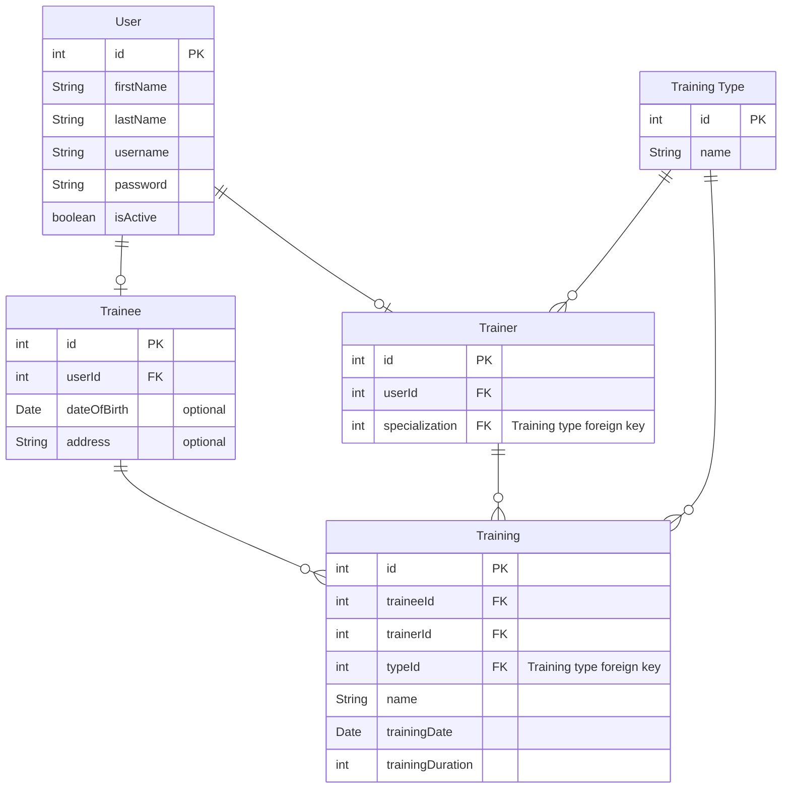

# Gym CRM

Spring based module, which handles gyn CRM system

## Database Schema



## REST

### Modeling information

1. **Participants**:

    - _Trainees_ and _Trainers_

2. **Actions**
    - _What actions does the participants take?_(could do a process diagram)
3. **Item Resources**
    - What are the items actions. (Lists, data,.....)
4. **Http Verbs**
    - Convert Item Resources actions into HTTP verbs. _(ej. List Items -> GET Items)_

## Logging

### Logging Level Information

- **TRACE**:
    - The most detailed log level.
    - Used for fine-grained or very detailed debugging information.
    - Typically used to log each step of a specific operation.
    - May produce a large number of log entries.

- **DEBUG**:
    - Used for detailed debugging information.
    - Provides more information than TRACE but less than INFO.
    - Useful for diagnosing issues during development and testing.
    - Not typically used in production systems to avoid excessive log output.

- **INFO**:
    - General information about the application's state or important events.
    - Commonly used to track application startup and shutdown, as well as significant milestones.
    - Typically useful for monitoring the overall health of the application.

- **WARN (Warning)**:
    - Indicates potential issues that should be reviewed but don't necessarily disrupt the application.
    - Typically used to log situations that may lead to errors or unexpected behavior.
    - Warn messages are usually yellow or orange in log viewers.

- **ERROR**:
    - Used for critical issues or errors that need immediate attention.
    - Represents a problem that may lead to the application's failure.
    - Often used for exception stack traces and fatal errors.
    - Red or similar colors are commonly associated with error messages in log viewers.

- **FATAL (or CRITICAL)**:
    - The most severe log level.
    - Represents a catastrophic failure or error that might cause the application to crash or become unusable.
    - Fatal errors often lead to application termination.

- **OFF**:
    - A special log level that turns off all logging. No log messages are captured or emitted when this level is used.
    - Typically used when no logging is desired or as a configuration setting to disable logging.

- **ALL**:
    - Another special log level used to enable capturing all log messages, including those at the lowest severity
      levels (
      TRACE and DEBUG).
    - Rarely used in practice, as it can lead to excessive log output.

## Json

When serializing objects into Jsons, we could come across some situations were we have circular dependencies. For
example, a _Trainer_ has a list of _Trainees_, and a _Trainee_ has a list of _Trainers_. If we were to try to convert
this into json we would stay in a loop. To solve this, there are some _annotations_ we can use from
the `com.fasterxml.jackson.annotation` package:

- `JsonManagedReference` & `JsonBackReference`: These annotations allow us to specify which property is a 'parent'_(
  managed)_ and which is a 'child'_(back)_. The managed property is converted normally, while the back property is
  handled specially (most of the time, it is ignored). For example:

  ```java 
  import java.util.List;
  
  class User {
    String name;
    
    List<Phone> phones;
  }
  
  class Phone {
      String model;
      
      User user;
  }
  ```
  In this case, we would be stuck in an infinite loop while serializing a `User`.
  ```json
  {
    "name": "the user name",
    "phones": [
      {
        "model": "first phone model",
        "user": {
          "name": "the user name",
          "phones": [
            {
              "model": "first phone model",
              "user": {
                "name": "the user name",
                "phones": [
                  {
                    "model": "first phone model",
                    "user": {
                      "name": "the user name",
                      "phones": [
                        {
                          "model": "first phone model",
                          "user": {
                            "name": "the user name",
                            "phones": [
                              {
                                "model": "first phone model",
                                "user": {
                                  "name": "the user name",
                                  "phones": [
                                    {
                                      "model": "first phone model",
                                      "user": "....................."
                                    }
                                  ]
                                }
                              }
                            ]
                          }
                        }
                      ]
                    }
                  }
                ]
              }
            }
          ]
        }
      }
    ]
  }
  ```
  Instead, we can do this:
  ```java
  import java.util.List;
  
  class User {
    String name;
    @JsonManagedReference
    List<Phone> phones;
  }
  
  class Phone {
      String model;
      @JsonBackReference
      User user;
  }
  ```
  In this case, when we convert a User into json, it will convert the User, with its phones, but will not convert the
  phones' user
  ```json
  {
    "name": "the user name",
    "phones": [
      {
        "model": "first phone model"
      }
    ]
  }
  ```
  This is very useful in one-to-may and many-to-one or one-to-one relationships
- `JsonIgnoreProperties`: This is used when we don't want to serialize a specific property, which isn't necessarily on
  our main object. It is mostly used in many-to-manu relationships, where we want to get an entity A with all related
  entities B, or an entity B with all its related entities A. For example: A student is in many courses, and a course
  has many students.

  ```java
  class Student {
      String name;
  
      List<Course> courses;
  }
  
  class Course {
      int courseId;
  
      List<Student> students;
  }
  ```

  If we try to serialize this like before, we will be stuck in an infinite loop. We could use
  the `JsonManagedReference`/`JsonBackReference` but what if we want to get a course with all its students or a student
  with all its courses. For this we can do:

  ```java
  class Student {
      String name;
      @JsonIgnoreProperies("students")
      List<Course> courses;
  }
  
  class Course {
      int courseId;
      @JsonIgnoreProperties("courses")
      List<Student> students;
  }
  ```
  If we want to get a student, then we will not convert `Course::students` into json. If we want to get a course, then
  we will not convert `Student::courses` into json.
  ```json
  {
    "name": "student name",
    "courses": [
      {
        "courseId": 1
      },
      {
        "courseId": 2
      },
      {
        "courseId": 3
      }
    ]
  }
  ```
  ```json
  {
    "courseId": 1,
    "students": [
      {
        "name": "student 1"
      },
      {
        "name": "student 3"
      },
      {
        "name": "student 2"
      }
    ]
  }
  ```
- `JsonIgnore`: allows us to mark a property so that it is ignored when converting to json. For example, we don't want
  to show a user's password, so we annotate this field so that it is ignored

```java
class User {
    String name;
    String password;
}
```

```json
{
  "name": "user's name"
}
```

## Actuator - Health Checks

https://docs.spring.io/spring-boot/docs/current/reference/html/actuator.html

## Security

- **Brute Force*+  
  Continue creating GymAuthenticationProvider. Add checks in todo and register login attempts
- **Logout**:  
  Store jwts in table and use enabled field. When logged out, disable (or delete jwt(signature)) from db

## Swagger

Include dependencies

```groovy
dependencies {
    implementation 'org.springdoc:springdoc-openapi-starter-webmvc-ui:2.2.0'
    implementation 'org.springdoc:springdoc-openapi-starter-webmvc-api:2.2.0'
}
```

Allow access to endpoints.

`http://localhost:8080/v3/api-docs`
`http://localhost:8080/swagger-ui.html`

### Document

- To add documentation of the api as a whole, use `@OpenAPIDefinition` at the application start point. Like this:
  ```java
  
  @OpenAPIDefinition(
          info = @Info(
                  title = "Gym CRM System",
                  description = "API Definitions of the Gym crm Microservice",
                  version = "1.0.0"
          )
  )
  public class GymApplication {
  
      public static void main(String[] args) {
          SpringApplication.run(GymApplication.class, args);
      }
  
  }
  ```
- For controllers, use `@Tag`:
  ```java
  @Tag(name = "Account endpoint", description = "Account actions")
  public class AccountController {
      // . . .
  }
  ```

- For the methods, use `@Operation`:
  ```java
  public class AccountController {
    @Operation(summary = "Logs the user in")
    public ResponseEntity<?> login() {
          // . . . 
      }
  }
  ```
- To specify the possible returns status codes use `@ApiResponse` or `@ApiResponses`:
  ```java
  @ApiResponses(value = {
          @ApiResponse(responseCode = "200", description = "Resource found"),
          @ApiResponse(responseCode = "404", description = "Resource not found"),
          @ApiResponse(responseCode = "500", description = "Internal server error")
  })
  @GetMapping("/resource/{id}")
  public ResponseEntity<Resource> getResourceById(@PathVariable Long id) {
      // Your logic to fetch the resource
      
      if (resourceIsFound) {
          return ResponseEntity.ok(resource);
      } else {
          return ResponseEntity.notFound().build();
      }
  }
  ```
  `@ApiResponses` annotation encapsulates multiple @ApiResponse annotations, each describing a specific HTTP response.

## Pièces de Résistance

Implementations that I really liked

- [SecurityService.java](src/main/java/com/javabootcamp/gym/security/services/SecurityService.java), use of `Supplier`s
  and `Function`s
- [ServiceHelper.java](src/main/java/com/javabootcamp/gym/services/helper/ServiceHelper.java), use of `Function`s
  and `Consumer`s
    - [UpdateServiceHelper.java](src/main/java/com/javabootcamp/gym/services/helper/UpdateServiceHelper.java)

## Configuration

To enable cloud configuration, we add the following to the `build.gradle`

```groovy
ext {
    set('springCloudVersion', "2022.0.3")
}

dependencies {
    implementation 'org.springframework.cloud:spring-cloud-starter-config'
}

dependencyManagement {
    imports {
        mavenBom "org.springframework.cloud:spring-cloud-dependencies:${springCloudVersion}"
    }
}
```

And set this property:

```properties
spring.config.import=optional:configserver:<config-server-url>
```

For example

```properties
spring.config.import=optional:configserver:http://localhost:8888
```

### Security

If the configuration server has default security enable we can set the following properties

```properties
spring.cloud.config.username=username
spring.cloud.config.password=username
```