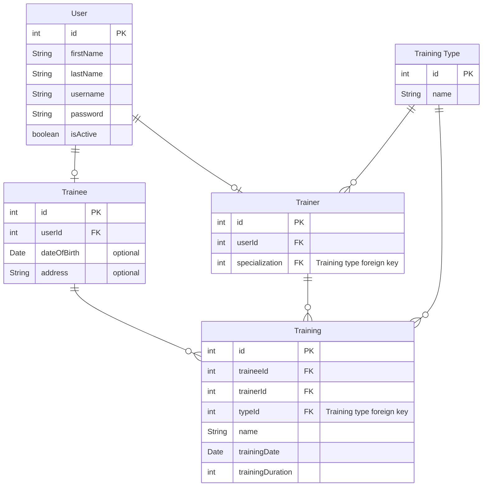

# Gym CRM

Spring based module, which handles gyn CRM system

## Database Schema

## REST

### Modeling information

1. **Participants**:

    - _Trainees_ and _Trainers_

2. **Actions**
   - _What actions does the participants take?_(could do a process diagram)
3. **Item Resources**
   - What are the items actions. (Lists, data,.....)
4. **Http Verbs**
   - Convert Item Resources actions into HTTP verbs. _(ej. List Items -> GET Items)_

## Logging

### Logging Level Information

- **TRACE**:
    - The most detailed log level.
    - Used for fine-grained or very detailed debugging information.
    - Typically used to log each step of a specific operation.
    - May produce a large number of log entries.

- **DEBUG**:
    - Used for detailed debugging information.
    - Provides more information than TRACE but less than INFO.
    - Useful for diagnosing issues during development and testing.
    - Not typically used in production systems to avoid excessive log output.

- **INFO**:
    - General information about the application's state or important events.
    - Commonly used to track application startup and shutdown, as well as significant milestones.
    - Typically useful for monitoring the overall health of the application.

- **WARN (Warning)**:
    - Indicates potential issues that should be reviewed but don't necessarily disrupt the application.
    - Typically used to log situations that may lead to errors or unexpected behavior.
    - Warn messages are usually yellow or orange in log viewers.

- **ERROR**:
    - Used for critical issues or errors that need immediate attention.
    - Represents a problem that may lead to the application's failure.
    - Often used for exception stack traces and fatal errors.
    - Red or similar colors are commonly associated with error messages in log viewers.

- **FATAL (or CRITICAL)**:
    - The most severe log level.
    - Represents a catastrophic failure or error that might cause the application to crash or become unusable.
    - Fatal errors often lead to application termination.

- **OFF**:
    - A special log level that turns off all logging. No log messages are captured or emitted when this level is used.
    - Typically used when no logging is desired or as a configuration setting to disable logging.

- **ALL**:
    - Another special log level used to enable capturing all log messages, including those at the lowest severity
      levels (
      TRACE and DEBUG).
    - Rarely used in practice, as it can lead to excessive log output.

