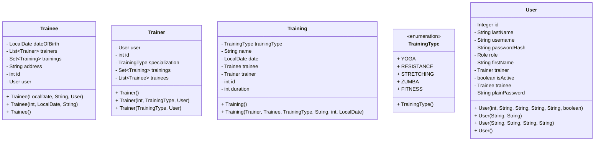
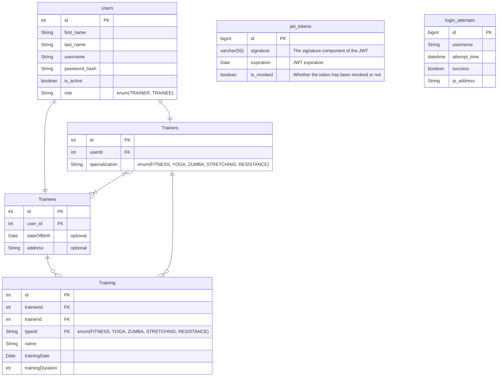
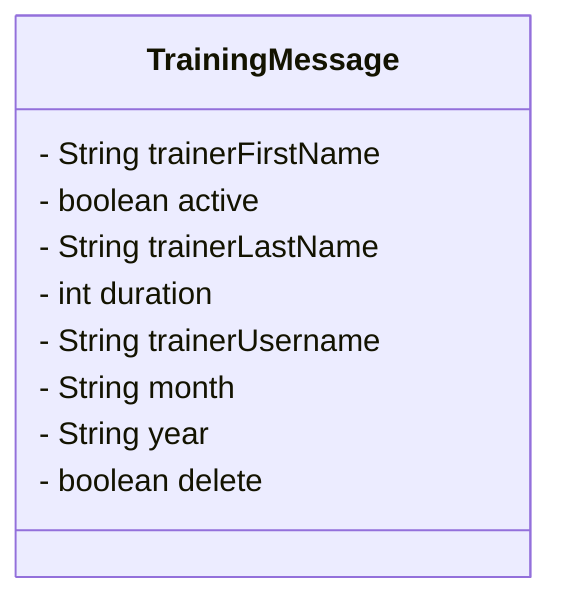

# Gym Microservices Project

This project was created to learn how to use Spring Boot, Spring Data, Spring Cloud and AWS.

## Overview

This project starts with a REST API that allows management of gym related entities, accounts, and trainings. When a new
training is created, it is sent to AWS SQS and processed by another microservice that will update a Dynamodb table, that
has the information of the trainers and their training hours of the month's years. At the end of each month, a AWS
Lambda Function will read the content of the DynamoDb table and creates csv report files in a S3 bucket.

## The project

This project contains the following microservices:

- [Gym Management](#gym-management): microservice that allows management of gym [entities](#class-diagram).
- [Reporting Service](#reporting-service): microservice to receive message reports
- [Configuration Server](#configuration-server): microservice to hold configurations for the other microservices. _It is
  not used at the moment_
- [Discovery Server](#discovery-server): discovery service to connect other microservices. _It is not used at the
  moment_

And uses the following AWS cloud resources (these are the principal resources, but there are more that are used by
these)

- [MySql RDS Database](https://aws.amazon.com/rds/). Database for all [entities](#entity-relationship-diagram)
- [Ec2 Instance](https://aws.amazon.com/ec2/). To run the microservices
- [Amazon Simple Queue Service (SQS)](https://aws.amazon.com/sqs/). Queue service to send/receive messages
- [S3 Buckets](https://aws.amazon.com/s3/). To store deployment files and monthly reports
- [DynamoDB Table](https://aws.amazon.com/dynamodb/)
- [Lambda Function](https://aws.amazon.com/lambda/). To create the monthly reports

All the **AWS** resources can be created using [AWS Cloudformation](https://aws.amazon.com/cloudformation/), with these
files:

- [deployment-bucket-stack.yaml](.aws/deployment-bucket-stack.yaml). You need to create this Cloudformation stack first,
  since the next stack uses it.
- [gym.yaml](.aws/gym.yaml). This stack creates **All** the resources needed by this application.

### Scripts

There are some very useful scripts that allow some configuration on the aws resources and in the GitHub pipeline.

- [create-environment-variables.sh](.aws/scripts/create-environment-variables.sh). This script will create a new file
  with some environment variables needed by the microservice (spring boot applications) during the GitHub action
  execution. These variables are taken from the GitHub repository secrets, so be careful with the output file. The
  workflow will create `environment-variables.sh` and send it to the **gym-deploy-bucket** S3 bucket in
  aws. `environment-variables.sh` is used by the next script.
- [instance-initialization.sh](.aws/scripts/instance-initialization.sh). This script is used inside the ec2 instance to
  start the application. It requires the file generated by the previous script, in order to set environment variables in
  the ec2 instance. It is important that before this script runs in the ec2 instance, to export `MICROSERVICE_NAME`
  environment variable, with the value of **crm** in case of the [CRM microservice](#gym-management) or **reporting** in
  the case of [Reporting Microservice](#reporting-service).  
  This script will download the `environment-variables.sh` file and the newest version of the required application from
  the s3 bucket (gym-deploy-bucket) and run it using the aws profile.

## Microservices

### Gym Management

_You can view the project [here](Gym)._

This microservice exposes a _REST API_ that allows users to register(as trainees or trainers), login, change password,
and create trainings; while at the same time sending messages to _SQS_

The only two actions that unauthenticated users can do is to register on either `/trainees/register` as a trainee
or `/trainers/register` as a trainer, and log in at `/account/login` to get a JWT; all other actions (view profiles,
change-password, create training...) must have users pass the authentication token on authorization header as a '
Bearer'.

When a user tries to log into the application, a new 'login-attempt' is created, with the user's username, date and time
of attempt, ip address and whether it was successful. Accounts become locked if there are 3 failed login attempts in a
span of 5 minutes (the accounts are unblocked after a while).

Each time a user logs into the application, a new jwt is created and a new entry is added to the 'jwt-tokens' table with
the tokens signature, in order to be able to track which tokens are still valid, which have been revoked.

When new trainings are created, a new message is added to a local service's queue which will be processed and send to
the _Amazon Simple Queue Service_, this service works asynchronously to avoid slowing the application.

#### Class Diagram

These are the core entities of the application:



#### Entity Relationship Diagram



#### Api Specification

You can view the [openapi specification here](gym-api-specification.json)

#### Sqs Outbound Message

This is the structure of the outbound sqs messages:



### Reporting Service

This microservice will receive messages from the AWS SQS, and will process them in order to create new entities in the
DynamoDb table.

This is the structure of an entry in dynamodb:

```json
{
  "trainerUsername": "username",
  "active": true,
  "summary": {
    "2020": {
      "DIC": 1,
      "JUL": 11,
      "JUN": 6,
      "OCT": 11
    },
    "2023": {
      "DIC": 5,
      "JUN": 3,
      "SEP": 10
    }
  },
  "trainerFirstName": "first name",
  "trainerLastName": "last name"
}
```

Each entry has a summary object that has keys for the years, each year has an object with key of the month and the value
is the aggregate of the training durations during that month.


