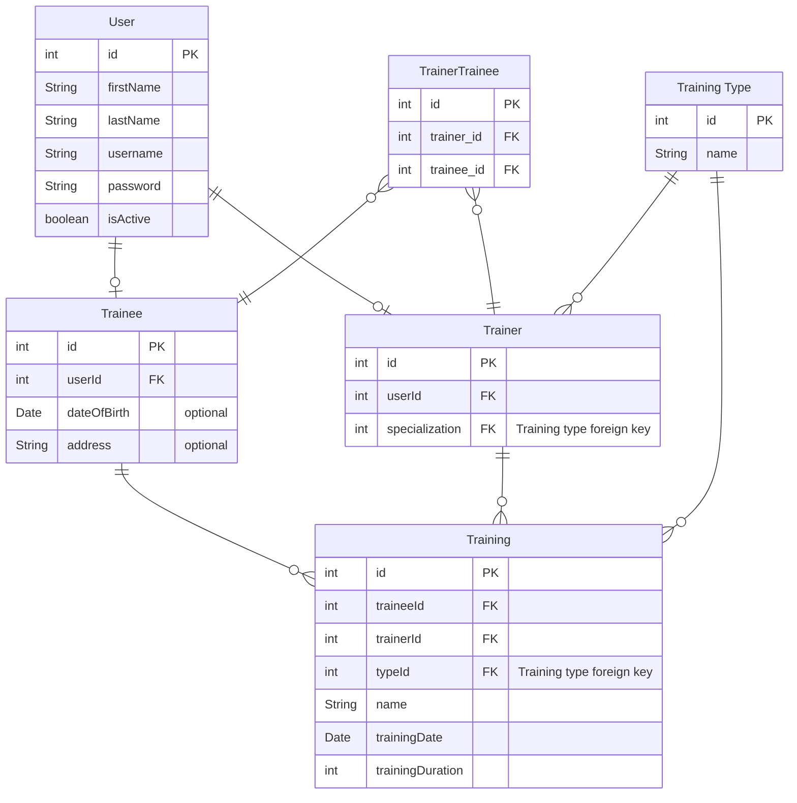
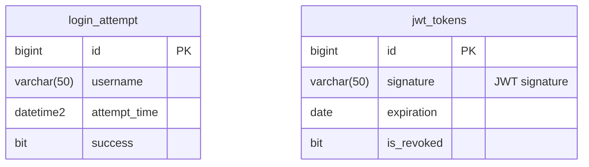

# Database

For the database, I used Microsoft SQL Server.

## Structure

### dbo

#### Diagram



### security

#### Diagram



## Stored Procedures

### [security].[Delete_Expired_Tokens]

Deletes tokens from the [security].[jwt_tokens] where the date is expired

```sql
CREATE PROCEDURE [security].[Delete_Expired_Tokens]
AS
BEGIN
    DELETE
    FROM [security].[jwt_tokens]
    WHERE [expiration] <= GETDATE()
END
GO
```
